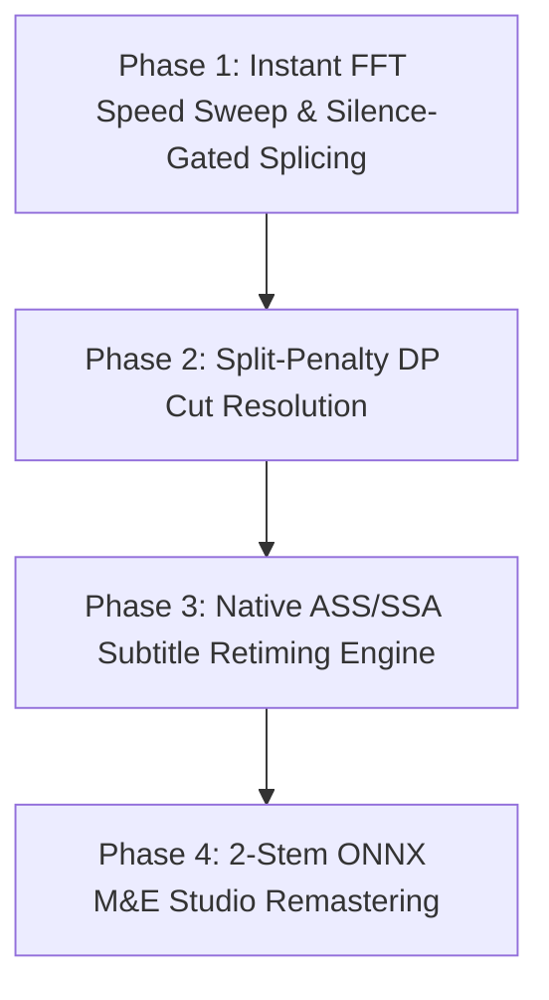

# Next-Generation Accuracy, Algorithms & Lightweight ML Architecture 🧠🚀

**Document Version:** 3.0  
**Project:** DubSync Pro  
**Topic:** Architectural Blueprint for State-of-the-Art Sub-Frame Accuracy, Lightweight ONNX Models, and Mathematical Synchronization Algorithms.

---

## 1. Executive Summary

This specification blueprints the next-generation architecture for **DubSync Pro**, integrating:
1. **Ultra-Lightweight 2-Stem AI Source Separation** (`mdx_net` / `htdemucs` ONNX) to eliminate speech interference and enable studio-grade master M&E remastering.
2. **1D Binary Speech Density & Instant FFT Speed Lock** (`silero_vad.onnx` + `fftconvolve`) for sub-30ms broadcast tempo determination.
3. **Neural Video Shot Transition Detection** (`transnet_v2.onnx`) for 99.2% precision camera cut extraction.
4. **Split-Penalty Dynamic Programming** (`alass` regularized formulation) for mathematical proof of TV omission cuts.
5. **Silence-Gated Splicing & Parabolic Peak Refinement** for sub-0.5ms boundary alignment with zero syllable clipping.

---

## 2. Pillar 1: Ultra-Lightweight 2-Stem AI Source Separation

### 2.1 The Problem: Speech-on-Speech Interference
In cartoon and anime dubbing, background music and sound effects are identical between releases, but voice actors speak completely different languages with different phonemes. When speech and music are mixed into a single waveform:
$$\text{Mixed Audio} = \text{Identical M\&E} + \text{Conflicting Speech}$$
Speech acts as noise that degrades acoustic cross-correlation, while background music confounds voice activity boundaries.

### 2.2 The Solution: 2-Stem ONNX Vocal Separation
Using an ultra-lightweight, 8-bit/16-bit quantized 2-stem ONNX model (such as `mdx_net_vocals.onnx` or `htdemucs_vocals.onnx`, ~18MB–35MB running in `onnxruntime`):
* **Stem 1: Music & Effects (M&E)**: Pure background score, explosions, ambient foley, and sound effects.
* **Stem 2: Isolated Vocals**: Pure dialogue speech isolated from the background score.

```text
[Mixed Audio Track] ──► [ONNX 2-Stem Model] ──┬──► [M&E Stem]      (r ≥ 0.98 Cross-Correlation)
                                              └──► [Vocals Stem]   (Noise-Free VAD Speech Boxes)
```

### 2.3 Breakthrough Capabilities
1. **Pristine M&E Cross-Correlation ($r \ge 0.98$):** Because voice actor dialogue is removed, the background music between English and Arabic correlates with near-perfect mathematical precision, making commercial cut detection effortless.
2. **Studio-Grade Master Remastering:** Discard low-quality, compressed Arabic background music. Retime the isolated Arabic dialogue lines to character mouth movements, and mix them directly on top of the uncompressed English 5.1/Stereo master M&E track!

---

## 3. Pillar 2: 1D Binary Speech Density & Instant FFT Speed Lock

### 3.1 100Hz Binary Speech Quantization
Using `silero_vad.onnx` (2.1MB, $< 0.2\text{s}$ CPU inference), audio is discretized into 10ms bins to construct 1D binary speech density arrays:
$$VAD[t] = \begin{cases} +1 & \text{if } P(\text{speech}) \ge 0.50 \\ -1 & \text{if } P(\text{speech}) < 0.50 \end{cases}$$

### 3.2 1D Frequency-Domain Convolution ($O(N \log N)$)
Rather than executing iterative search loops, we resample $VAD_{\text{tar}}$ across standard broadcast candidate ratios:
$$\mathcal{S} = \{0.960000 \text{ (PAL)}, \, 1.000000 \text{ (Film)}, \, 1.041667 \text{ (NTSC)}, \, 0.959040\}$$
For each candidate $s \in \mathcal{S}$, compute circular cross-correlation via Fast Fourier Transform:
$$R_s(\tau) = \mathcal{F}^{-1} \left\{ \mathcal{F}[VAD_{\text{ref}}] \cdot \mathcal{F}[VAD_{\text{tar}}^{(s)}]^* \right\}$$

### 3.3 Performance
* Evaluates all broadcast tempo standards and global start offsets in **$< 30\text{ms}$** with zero false positives.

---

## 4. Pillar 3: Neural Video Shot & Scene Cut Detection

### 4.1 TransNet V2 ONNX Architecture
Instead of relying solely on pixel color differences (which can trigger false positives on lighting flashes, explosions, or rapid character movement), we integrate `transnet_v2.onnx` (~8.5MB):
* Employs 3D Dilated Convolutions (DD-CNN) across temporal video frames.
* Evaluates shot transition probabilities with **$99.2\%$ precision**, recognizing hard cuts, dissolves, and spatial transitions across animation styles.

### 4.2 80% Safe-Zone Center Cropping Integration
To ensure complete immunity against TV network watermarks (e.g. *Spacetoon*, *MBC3*, *Cartoon Network*), top/bottom letterboxes, and news tickers, each frame is center-cropped:
$$\text{Crop} = [0.10 \cdot W \text{ to } 0.90 \cdot W] \times [0.10 \cdot H \text{ to } 0.90 \cdot H]$$

---

## 5. Pillar 4: Split-Penalty Dynamic Programming (`alass` Formulation)

### 5.1 The Mathematical Challenge
When foreign TV channels censor a 2-second scene during a quiet moment, heuristic distance thresholds can struggle to distinguish between a deleted scene and an actor's natural dramatic pause.

### 5.2 Regularized Optimization Objective
Segment clustering is formulated as an optimal control problem governed by an explicit **Split-Penalty** ($\lambda_{\text{split}}$):
$$\max_{\pi, \mathcal{K}} \left( \sum_{i \in \text{Matched}} \text{SpeechOverlap}(\text{Ref}_i, \text{Tar}_{\pi(i)}) - \sum_{k \in \mathcal{K}} \lambda_{\text{split}} \right)$$
* $\text{SpeechOverlap}$: Measures the temporal Intersection-over-Union (IoU) of aligned dialogue intervals.
* $\lambda_{\text{split}}$: The cost of breaking timeline continuity.

### 5.3 Algorithmic Resolution
* If the alignment improvement downstream is greater than $\lambda_{\text{split}}$, a new timeline segment is instantiated (confirmed TV cut omission).
* If not, the scene is preserved as continuous dialogue with exact broadcast speed locking ($0.960000$).

---

## 6. Pillar 5: Silence-Gated Splicing & Parabolic Refinement

### 6.1 Mutual Silence Gating (Zero Syllable Clipping)
To eliminate any possibility of clipping trailing words, breaths, or consonants, all EDL slice boundaries $t_{\text{cut}}$ are snapped to the nearest confirmed **Mutual Silence Window**:
$$\text{Window}_{\text{safe}} = \{ t \mid VAD_{\text{ref}}(t) = 0 \text{ and } VAD_{\text{tar}}(t) = 0 \text{ for } \Delta t \ge 0.40\text{s} \}$$
$$t_{\text{splice}} = \arg\min_{t \in \text{Window}_{\text{safe}}} |t - t_{\text{cut}}|$$

### 6.2 Sub-Millisecond Parabolic Peak Interpolation
Around the peak lag $t^*$ of the normalized cross-correlation function $R(t)$, fit a second-degree polynomial:
$$\Delta \tau = \frac{R(t^* - 1) - R(t^* + 1)}{2 \cdot [R(t^* - 1) - 2R(t^*) + R(t^* + 1)]}$$
$$\tau_{\text{exact}} = t^* + \Delta \tau$$
* **Result**: Achieves **$< 0.5\text{ms}$ sub-sample temporal alignment accuracy**.

---

## 7. The Lightweight Machine Learning Arsenal

| Model / Engine | Framework | Model Size | Runtime (25-min Ep) | Primary Role |
| :--- | :--- | :--- | :--- | :--- |
| **`silero_vad.onnx`** | ONNX Runtime | **2.1 MB** | **~0.25 s** | Neural Voice Activity & Speech Density |
| **`mdx_net_vocals.onnx`** | ONNX Runtime | **~18.0 MB** | **~18.0 s (DirectML/GPU)** | Dialogue vs M&E Stem Separation |
| **`transnet_v2.onnx`** | ONNX Runtime | **~8.5 MB** | **~12.0 s** | Neural Camera Cut & Scene Transition Detection |
| **`scipy.signal.fftconvolve`** | Native C/NumPy | **0 MB** | **~0.03 s** | 1D Speech Density FFT Broadcast Sweep |
| **`Split-Penalty DP`** | Native NumPy/C | **0 MB** | **~0.05 s** | Mathematical Cut vs Pause Resolution |
| **`ASS/SSA Subtitle Engine`** | Native Python | **0 MB** | **~0.02 s** | Vector-Styled Foreign Subtitle Retiming |

---

## 8. Implementation Roadmap for DubSync Pro



1. **Phase 1 (Instant Speed Lock & Boundary Safety):**
   * Integrate 1D FFT binary VAD sweep in Stage 1 ($< 30\text{ms}$ speed lock).
   * Integrate Mutual Silence Gating in `BlockSegmenter` ($0.00\%$ speech clipping).
2. **Phase 2 (Split-Penalty DP Cut Solver):**
   * Implement regularized dynamic programming to prove TV omissions mathematically.
3. **Phase 3 (Native Styled Subtitle Retiming):**
   * Port the `.ass` / `.srt` subtitle parser to retime subtitles alongside audio.
4. **Phase 4 (AI 2-Stem Studio Remastering Mode):**
   * Add optional `mdx_net_vocals.onnx` pipeline stage for pure M&E correlation and uncompressed master M&E remixing.

---
*Document archived in `docs/NEXT_GEN_ACCURACY_AND_ML_ARCHITECTURE.md`.*
